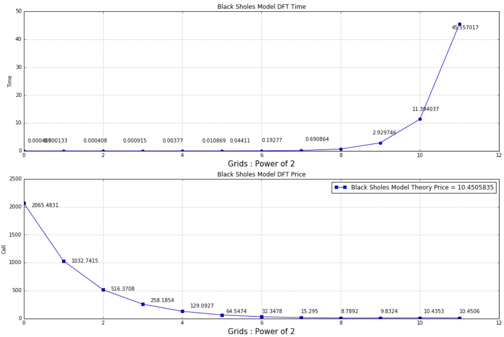
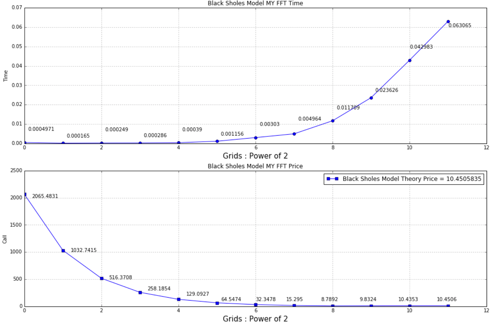
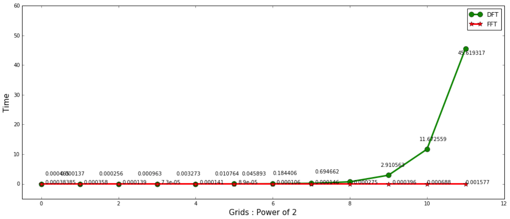
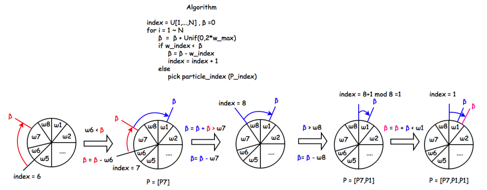
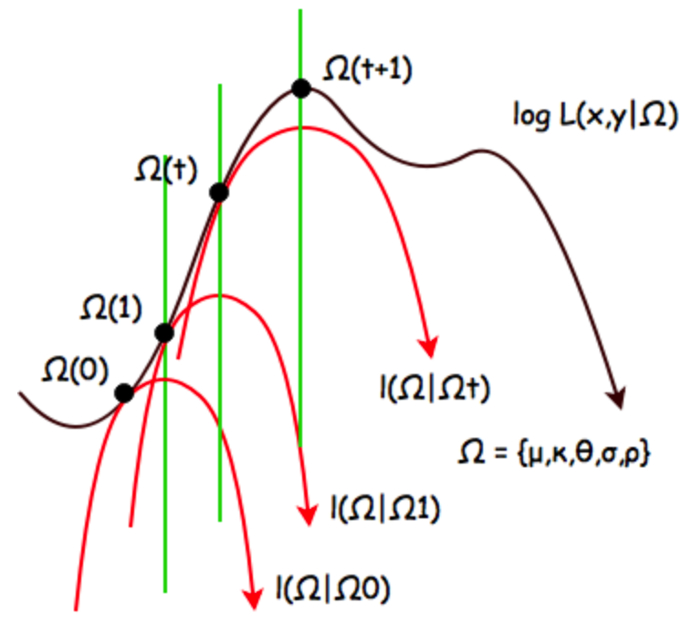
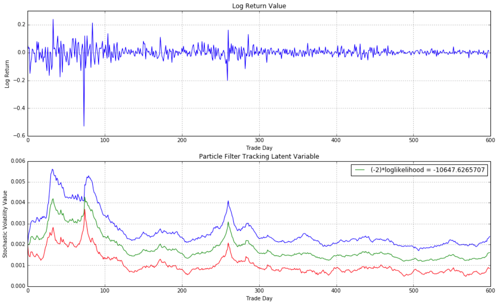

## Development Tools

Python - math, numpy, scipy

## Implement Option pricing using FFT

[Code] (https://github.com/rorysroes/Option_Pricing_and_Parameter_Estimater/blob/master/Option_Pricing_Using_DFT_FFT.ipynb):
This project I implemented Cooley-Tukey FFT algorithm with 2_radix to solve the option pricing formula by Simpson's rule weightings.

Using DFT to option pricing

 
 
Using FFT to option pricing

 
 
Compare DFT & FFT efficiency with pricing time 

 

## Implement SV Model Parameter Estimater using Particle Filter &amp; EM

[Code] (https://github.com/rorysroes/Option_Pricing_and_Parameter_Estimater/blob/master/SV_Model_Parameter_Estimate_Using_Particle_Filter_EM.ipynb):
This project I implemented Particle Farticle(sequential importance resampling algorithm)(SIR) algorithm and Expectation-maximization algorithm to estimate parameters.

Resampling Method

[Learning from Udacity] (https://classroom.udacity.com/courses/cs373/lessons/48739381/concepts/487350240923)

EM Algorithm

Tracing Outcomes

